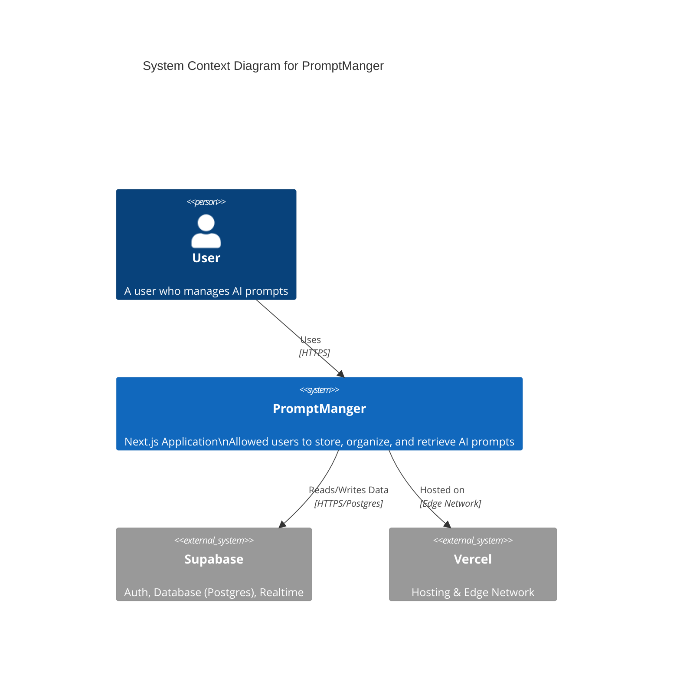

# Architecture Overview

本文件作為一個關鍵的、動態的模板，旨在讓開發者能夠快速、全面地理解程式碼庫的架構，確保從第一天起就能高效導航並有效貢獻。請隨著程式碼庫的演變更新此文件。

## 1. Project Structure

本節提供專案目錄和檔案結構的高層次概述，按架構層或主要功能區域分類。這對於快速導航程式碼庫、定位相關檔案以及理解整體的組織和關注點分離至關重要。

```
d:/@GitHubProject/promptManer/
├── src/
│   ├── app/                    # Next.js App Router 頁面與路由
│   │   ├── api/trpc/           # tRPC API 端點 (Route Handler)
│   │   ├── auth/               # 認證相關 Callback 處理
│   │   ├── dashboard/          # [受保護] 儀表板與主要功能頁面
│   │   ├── login/              # 登入頁面
│   │   └── page.tsx            # 產品首頁 (Landing Page)
│
│   ├── components/             # React 元件庫
│   │   ├── ui/                 # 基礎 UI 元件 (基於 shadcn/ui)
│   │   └── providers/          # 全域 Context Providers
│
│   ├── lib/                    # 核心函式庫與工具
│   │   ├── supabase/           # Supabase 客戶端 (Browser/Server/Middleware)
│   │   └── utils.ts            # 通用工具函式
│
│   ├── server/                 # 伺服器端核心邏輯
│   │   └── trpc/               # tRPC 相關設定與 Routers
│   │       ├── routers/        # API 業務邏輯路由
│   │       └── init.ts         # tRPC 初始化
│
│   └── middleware.ts           # Next.js 中間件 (路由保護與 Session 管理)
│
├── docs/                       # 專案文檔
├── public/                     # 靜態資源
└── package.json                # 專案依賴與腳本
```

## 2. High-Level System Diagram

PromptManger 是一個基於 Next.js 的全端應用，利用 Supabase 作為後端服務。



## 3. Core Components

### 3.1. Frontend
*   **Name**: PromptManger Web App
*   **Description**: 主要的使用者介面，提供登入、提示詞管理 (CRUD)、搜尋過濾與儀表板預覽功能。採用 Server Components 預先渲染，並透過 Client Components 處理互動。
*   **Technologies**: Next.js 15 (App Router), React 19, Tailwind CSS, shadcn/ui, TanStack Query v5.
*   **Deployment**: Vercel (Edge Network).

### 3.2. Backend Services
#### 3.2.1. API Layer (tRPC)
*   **Name**: tRPC Server
*   **Description**: 提供端對端的型別安全 API。定義了所有的業務邏輯 Procedure (如 `prompt.create`, `prompt.list`)，並透過 Next.js Route Handlers 暴露。
*   **Technologies**: tRPC v11, Zod (驗證), Next.js API Routes.
*   **Deployment**: Vercel Serverless/Edge Functions.

#### 3.2.2. Database & Auth Service
*   **Name**: Supabase
*   **Description**: 提供完整的後端即服務 (BaaS)，包括 PostgreSQL 資料庫儲存、身份驗證 (Auth) 以及行級安全 (RLS) 策略執行。
*   **Technologies**: PostgreSQL, GoTrue (Auth), PostgREST.
*   **Deployment**: Supabase Cloud.

## 4. Data Stores

### 4.1. Primary Database
*   **Name**: Supabase PostgreSQL
*   **Type**: PostgreSQL (Relational Database)
*   **Purpose**: 儲存所有的應用程式狀態，包括使用者資料、提示詞內容、標籤關聯等。
*   **Key Schemas/Collections**: `profiles` (使用者), `prompts` (提示詞), `tags` (標籤)。

## 5. External Integrations / APIs

*   **Service Name**: Supabase Auth
    *   **Purpose**: 處理使用者註冊、登入與 Session 管理。
    *   **Integration Method**: Supabase Client SDK (@supabase/ssr).

*   **Service Name**: GitHub OAuth (via Supabase)
    *   **Purpose**: 允許使用者透過 GitHub帳號 登入。
    *   **Integration Method**: OAuth 2.0.

## 6. Deployment & Infrastructure

*   **Cloud Provider**: Vercel
*   **Key Services Used**: Vercel Hosting (Next.js), Supabase (Database/Auth).
*   **CI/CD Pipeline**: GitHub Actions (linting/testing) -> Vercel Deployment (Auto-deploy on push to main).
*   **Monitoring & Logging**: Vercel Analytics, Supabase Logs.

## 7. Security Considerations

*   **Authentication**: 使用 Supabase Auth 進行 JWT 驗證。Next.js Middleware 負責保護私有路由。
*   **Authorization**: 資料庫層級使用 Postgres RLS (Row Level Security) 確保使用者只能存取屬於自己的資料 (`auth.uid() = user_id`)。
*   **Data Encryption**: HTTPS 傳輸加密，Supabase 靜態資料加密。

## 8. Development & Testing Environment

*   **Local Setup Instructions**:
    1. `cp .env.example .env.local` 並填入 Supabase keys。
    2. `pnpm install`
    3. `pnpm dev` 啟動 Turbopack 開發伺服器。
*   **Testing Frameworks**: Vitest (單元測試).
*   **Code Quality Tools**: Biome (Linting & Formatting), TypeScript (Strict Mode).

## 9. Future Considerations / Roadmap

*   **Folder Organization**: 實作資料夾結構以更好地組織 Prompt。
*   **Version History**: 追蹤 Prompt 的版本變更歷史。
*   **Team Collaboration**: 支援團隊共享與權限管理 (Phase 3)。
*   **Browser Extension**: 開發瀏覽器擴充功能以方便在其他網頁使用 Prompt。

## 10. Project Identification

*   **Project Name**: PromptManger (promptManer)
*   **Repository URL**: [Local] d:/@GitHubProject/promptManer
*   **Primary Contact/Team**: [User]
*   **Date of Last Update**: 2026-01-01

## 11. Glossary / Acronyms

*   **tRPC**: TypeScript Remote Procedure Call (端對端型別安全 API 架構)
*   **RLS**: Row Level Security (PostgreSQL 的行級安全機制)
*   **RSC**: React Server Components
