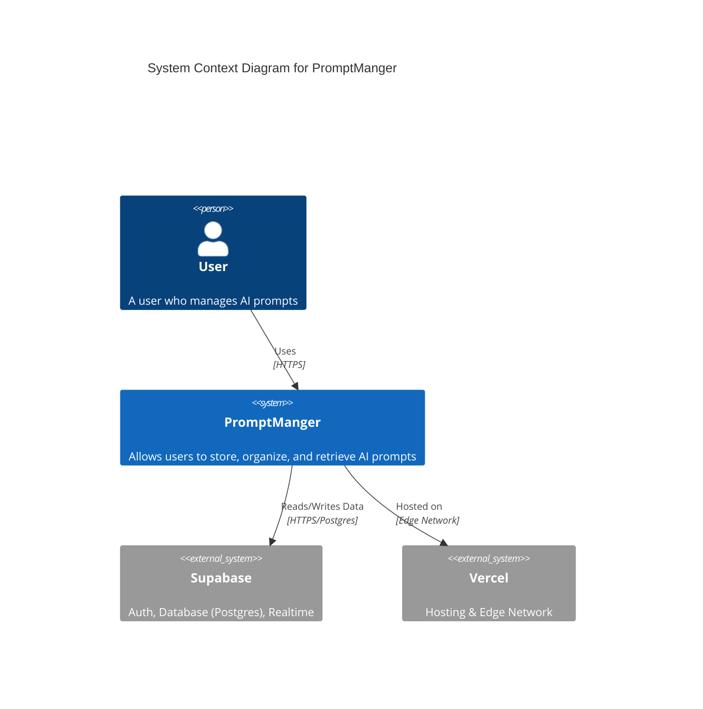

# 專案架構 (Architecture)

PromptManger 採用了現代化的全端 TypeScript 架構，旨在提供高效能、型別安全且易於維護的開發體驗。

## 系統上下文 (System Context)

以下是 PromptManger 的 C4 System Context 圖，展示了使用者與系統及其外部依賴的關係。



## 核心技術棧 (Tech Stack)

### 1. 核心框架 (Core Framework)
*   **Next.js 15 (App Router)**:
    *   **架構**: 採用 App Router，利用 React Server Components (RSC) 預設在伺服器端渲染，減少用戶端 Bundle 體積。
    *   **Turbopack**: 開發環境使用 Turbopack (`next dev --turbopack`)，提供毫秒級的熱更新 (HMR)。
    *   **Streaming**: 利用 React Suspense 實作串流渲染，優先展示 UI 骨架屏 (Skeleton Screen)，逐步載入資料。
*   **React 19**:
    *   **Server Actions**: 直接在 Server Component 中定義非同步函式處理表單提交，替代了傳統的 API Route 模式，簡化了資料變更邏輯。
    *   **useOptimistic**: 配合 Server Actions 實作樂觀 UI 更新，提升使用者感知的回應速度。
    *   **Compiler**: React 19 的編譯器自動優化重渲染，減少了 `useMemo` 和 `useCallback` 的手動使用需求。

### 2. 程式語言 (Language)
*   **TypeScript 5.x**: 全專案採用嚴格模式 (Strict Mode)。
    *   **End-to-End Type Safety**: 從資料庫 Schema (Supabase) 到 後端 API (tRPC) 再到 前端元件，型別完全打通。修改資料庫欄位，前端會自動報錯。

### 3. 後端與 API (Backend & API)
*   **tRPC v11**:
    *   **Native TanStack Query Integration**: v11 版本移除了舊版 API，深度整合 TanStack Query，提供了更符合直覺的 `queryOptions` 和 `mutationOptions`。
    *   **Type Inference**: 無需程式碼生成 (Codegen)，直接推導後端 Router 型別。
    *   **Middleware**: 使用 tRPC 中間件處理權限驗證 (Protected Procedures)。
*   **Supabase (BaaS)**:
    *   **PostgreSQL**: 核心資料庫，支援複雜的 SQL 查詢和 JSONB 資料型別（適合儲存靈活的 Prompt 結構）。
    *   **Auth (GoTrue)**: 提供基於 JWT 的無狀態認證，支援 OAuth (GitHub) 和 信箱/密碼登入。
    *   **Row Level Security (RLS)**: 安全策略下放至資料庫層。例如 `auth.uid() = user_id` 策略確保使用者只能存取自己的資料。
    *   **@supabase/ssr**: 專門適配 Next.js 的 SSR 函式庫，處理 Cookie 的讀寫（Server Component 唯讀，Server Action/Route Handler 可寫）。

### 4. 前端與狀態管理 (Frontend & State)
*   **TanStack Query v5**:
    *   **Server-Side Prefetching**: 在 Server Component 中預取資料，透過 `HydrationBoundary` 傳遞給用戶端，實作首屏即有資料 (No Loading Spinner)。
    *   **Stale-While-Revalidate**: 智慧快取策略，系統於背景自動更新資料。
*   **Tailwind CSS 3.4**:
    *   **JIT Engine**: 按需生成 CSS，生產環境 CSS 檔案極小。
    *   **Configuration**: 透過 `tailwind.config.ts` 自定義顏色系統（CSS 變數）以支援深色模式。
*   **shadcn/ui**:
    *   **Philosophy**: 不是 npm 套件，而是複製程式碼。擁有程式碼的完全控制權。
    *   **Radix UI**: 底層使用 Radix UI 無頭元件 (Headless Components)，保證無障礙存取 (A11y) 和鍵盤導覽支援。
*   **Lucide React**: 統一的 SVG 圖示庫，支援 Tree Shaking。

### 5. 工具鏈 (Tooling)
*   **Biome**:
    *   **Performance**: 基於 Rust 編寫，比 ESLint + Prettier 快 30 倍以上。
    *   **Unified**: 統一了 Linting 和 Formatting，避免了規則衝突。
*   **Vitest**:
    *   **Vite Native**: 複用 Vite 設定（路徑別名等），無需額外設定 Jest。
    *   **Watch Mode**: 極速的監聽模式，適合 TDD 開發。
*   **pnpm**:
    *   **Symlinks**: 使用軟連結管理依賴，極大節省磁碟空間並提升安裝速度。

---

## 目錄結構 (Project Structure)

```
src/
├── app/                    # Next.js App Router 頁面
│   ├── api/trpc/           # tRPC API 端點 (Route Handler)
│   ├── auth/               # 認證相關頁面 (Callback 處理)
│   ├── dashboard/          # 受保護的儀表板頁面 (Server Components)
│   ├── login/              # 登入頁面
│   ├── layout.tsx          # 根佈局 (包含 Providers)
│   └── page.tsx            # 登陸頁 (Landing Page)
├── components/             # React 元件
│   ├── providers/          # 全域 Context Providers (QueryClient, TRPCClient)
│   └── ui/                 # shadcn/ui 元件 (Button, Input, Dialog 等)
├── lib/                    # 核心函式庫與工具
│   ├── supabase/           # Supabase 用戶端設定 (Browser, Server, Middleware)
│   ├── env.ts              # 環境變數 Zod 驗證
│   ├── query-client.ts     # QueryClient 全域設定 (StaleTime 等)
│   └── utils.ts            # 通用輔助函式 (cn, date formatting)
├── server/                 # 伺服器端邏輯
│   └── trpc/               # tRPC 核心設定
│       ├── routers/        # API 路由定義 (PromptRouter, TagRouter)
│       ├── client.ts       # 用戶端 tRPC 實例 (CreateTRPCContext)
│       ├── init.ts         # tRPC 初始化 (Context, Middlewares, Procedures)
│       └── server.ts       # 伺服器端 Caller (Server Components 直接呼叫)
└── middleware.ts           # Next.js 中間件 (Auth Redirects & Session Refresh)
```
