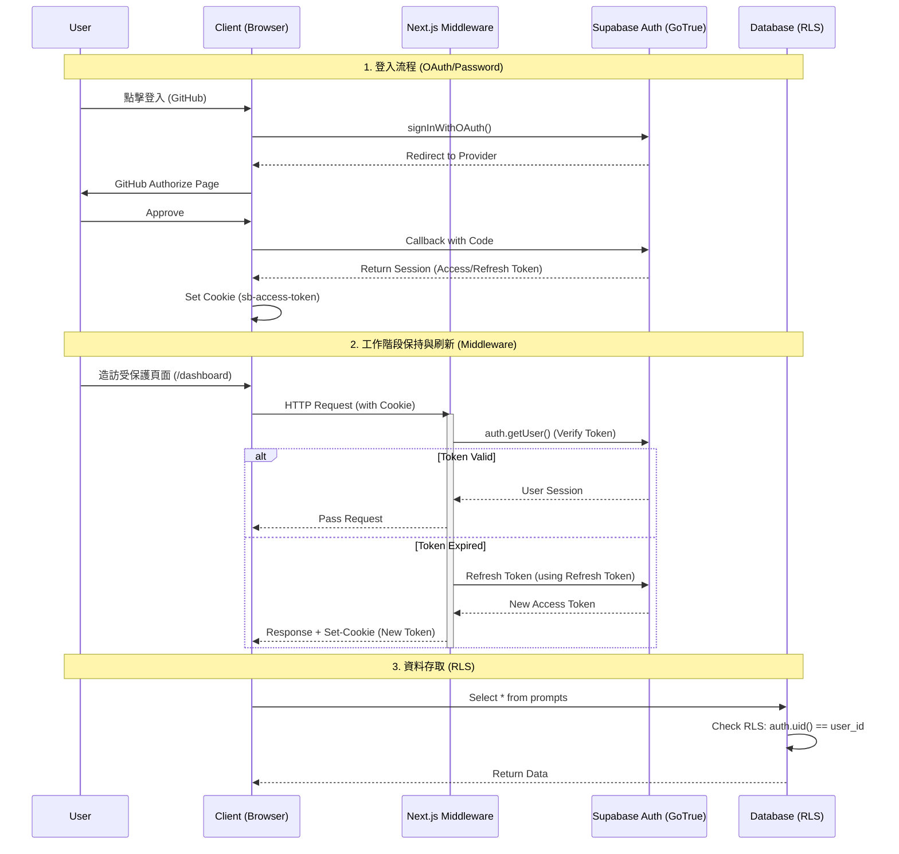

# 認證架構 (Authentication Architecture)

認證是全端應用程式中核心的一部分。本專案利用 **Supabase Auth** 和 **Next.js Middleware** 實作了一套安全、無縫的認證流程。

## 認證流程圖 (Authentication Flows)

以下是使用者登入、工作階段 (Session) 維持與登出的完整時序圖。



## 關鍵技術點

### 1. PKCE 流程 (Proof Key for Code Exchange)
我們在伺服器端認證（SSR）中強制使用 PKCE 流程。
*   **安全性**: 防止授權碼攔截攻擊。
*   **機制**: 在重新導向登入時生成一個 code_verifier，在回呼 (Callback) 時驗證這個 verifier。`@supabase/ssr` 函式庫會自動處理這一切。

### 2. Middleware 的核心作用
檔案：`src/middleware.ts` & `src/lib/supabase/middleware.ts`

Middleware 在 Next.js 中極其關鍵，因為它執行於任何頁面渲染之前。
*   **Session 刷新**: Supabase 的 Access Token 有效期較短（通常 1 小時）。Middleware 負責檢查 Token 是否快過期。如果是，它會呼叫 Supabase 刷新 Token，並透過 `Set-Cookie` Header 將新 Token 發回瀏覽器。
    *   **注意**: 必須將 `response` 物件傳遞回 Next.js 流程，否則新 Cookie 會遺失，導致使用者每小時被登出一次。
*   **路由守衛**:
    *   **白名單**: `login`, `auth/*`, `static files`。
    *   **黑名單**: `dashboard`, `prompts`。
    *   如果未登入造訪黑名單 -> Redirect to `/login`。
    *   如果已登入造訪 `/login` -> Redirect to `/dashboard`。

### 3. 多端 Supabase Client

我們根據執行環境不同，封裝了三種 Supabase Client：

| Client 類型 | 檔案路徑 | 用途 | 關鍵特性 |
| :--- | :--- | :--- | :--- |
| **Browser Client** | `lib/supabase/client.ts` | 用戶端元件 (`useEffect`, Event Handlers) | 單例模式，自動讀取瀏覽器 Cookie。 |
| **Server Client** | `lib/supabase/server.ts` | Server Components, Server Actions, Route Handlers | **唯讀/讀寫分離**。在 Server Component 中無法設定 Cookie，只能讀取。在 Actions 中可以設定。 |
| **Middleware Client** | `lib/supabase/middleware.ts` | `middleware.ts` | 專門處理 Request/Response 物件的 Cookie 讀寫。 |

### 4. 資料安全 (Row Level Security)

這是最後一道防線。即便駭客竊取了 Anon Key（這是公開的），也無法繞過 RLS。
*   **`auth.uid()`**: Supabase 提供的一個特殊 SQL 函式，回傳目前 JWT 解析出的 User ID。
*   **策略**:
    ```sql
    CREATE POLICY "Enable insert for authenticated users only"
    ON "public"."prompts"
    AS PERMISSIVE FOR INSERT
    TO authenticated
    WITH CHECK ((auth.uid() = user_id));
    ```
    這條策略保證了使用者建立資料時，`user_id` 欄位必須等於他們自己的 ID。
