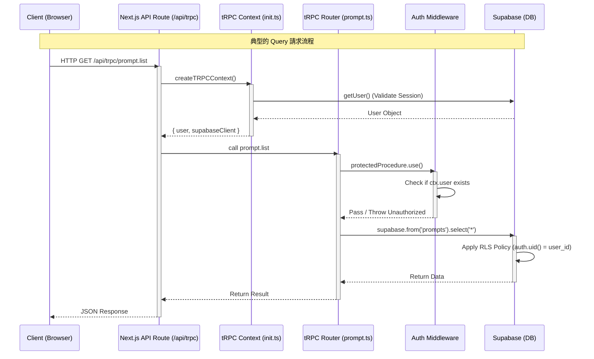
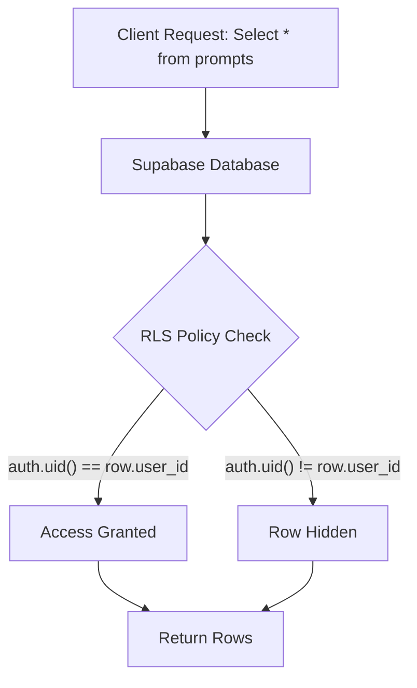

# 後端架構 (Backend Architecture)

PromptManger 後端架構基於 **tRPC v11** 和 **Supabase** 建構，充分利用了 Serverless 和 Edge 的優勢。

## tRPC 請求生命週期 (Request Lifecycle)

下面的時序圖展示了一個典型的 tRPC 請求（例如：取得 Prompt 列表）是如何在系統中執行的。



## tRPC v11 深度解析

本專案使用的是 tRPC v11，它帶來了顯著的架構改進。

### 1. 初始化與上下文 (Initialization & Context)
檔案：`src/server/trpc/init.ts`

*   **Context Isolation**: 每個請求都會生成獨立的 Context。
    *   **Supabase Client**: 我們在 Context 中初始化 Supabase Server Client。這至關重要，因為它會自動解析請求中的 Cookie，確保後續資料庫操作能正確辨識目前使用者。
    *   **Performance**: `getUser()` 呼叫在 Context 建立時發生。雖然這增加了一次 Supabase Auth API 呼叫，但為了安全性（驗證 Token 簽章和有效期限），這是必要的。

### 2. 路由 (Routers) 與 程序 (Procedures)
檔案：`src/server/trpc/routers/`

*   **Builder Pattern**: 使用 `t.router` 和 `t.procedure` 建構 API。
*   **Input Validation**: 結合 `zod` 函式庫進行執行階段參數驗證。
    ```typescript
    // 範例：建立 Prompt
    create: protectedProcedure
      .input(z.object({
        title: z.string().min(1),
        content: z.string(),
      }))
      .mutation(async ({ ctx, input }) => {
        // ...
      })
    ```
*   **Error Handling**: 使用 `TRPCError` 丟出標準 HTTP 錯誤（如 `BAD_REQUEST`, `UNAUTHORIZED`），前端會自動捕捉並處理。

### 3. Server-Side Callers
檔案：`src/server/trpc/server.ts`

在 Next.js Server Components 中，我們不需要發送 HTTP 請求，而是直接呼叫後端函式。tRPC 提供了 `createCaller` 來實作這一點。
*   **Zero Latency**: 直接在伺服器內部執行函式，沒有網路開銷。
*   **Reusability**: 前端元件（透過 HTTP）和 伺服器端元件（直接呼叫）複用同一套 Router 邏輯。

## Supabase 資料庫與安全

### 1. 資料庫模式 (Database Schema)

雖然 Supabase 是 Schemaless 的 JSON 友善型資料庫，但我們主要使用其關聯式特性 (PostgreSQL)。

主要表結構範例：
*   **profiles**: 儲存使用者資訊（關聯 `auth.users`）。
*   **prompts**: 儲存 Prompt 資料。
    *   `id`: UUID
    *   `user_id`: UUID (Foreign Key -> auth.users)
    *   `title`: Text
    *   `content`: Text (支援 Markdown)
    *   `variables`: JSONB (儲存模板變數 `{{var}}`)

### 2. 行級安全性 (Row Level Security, RLS)

RLS 是 Supabase 安全模型的核心。我們不依賴應用層程式碼（如 `where user_id = current_user`）來過濾資料，而是強制在資料庫層執行。

**RLS 策略範例圖解：**



這意味著即使開發者在後端程式碼中忘記寫 `.eq('user_id', user.id)`，資料也不會洩漏。

### 3. @supabase/ssr

在 Next.js 環境中，Cookie 管理很複雜。`@supabase/ssr` 解決了以下問題：
*   **Browser**: 自動處理 `localStorage` 到 Cookie 的遷移。
*   **Server Component**: 唯讀 Cookie（因為 RSC 在回應流開始後無法設定 Header）。
*   **Middleware**: 攔截請求，刷新即將過期的 Token，並寫入 Response Cookie。
*   **Server Action / Route Handler**: 可以讀寫 Cookie，用於登入、註冊等操作。
